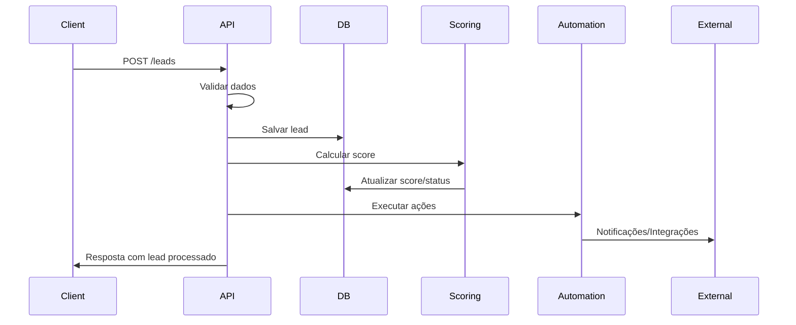

# 📐 Arquitetura do Sistema StreamLeads

## Visão Geral

O StreamLeads é um sistema de automação de leads desenvolvido com arquitetura modular e escalável, seguindo os princípios de Clean Architecture e Domain-Driven Design (DDD).

## 🏗️ Arquitetura Geral

```
┌─────────────────┐    ┌─────────────────┐    ┌─────────────────┐
│   Frontend      │    │   Backend       │    │   Database      │
│   (Streamlit)   │◄──►│   (FastAPI)     │◄──►│  (PostgreSQL)   │
└─────────────────┘    └─────────────────┘    └─────────────────┘
                              │
                              ▼
                       ┌─────────────────┐
                       │   Automações    │
                       │     (n8n)       │
                       └─────────────────┘
```

## 🎯 Componentes Principais

### 1. API Backend (FastAPI)

**Responsabilidades:**
- Recebimento e validação de leads
- Processamento de scoring automático
- Execução de automações
- Fornecimento de dados para o dashboard
- Integração com sistemas externos

**Estrutura:**
```
app/
├── api/           # Endpoints REST
├── models/        # Modelos de dados (SQLAlchemy)
├── schemas/       # Validação de dados (Pydantic)
├── services/      # Lógica de negócio
├── repositories/  # Acesso a dados
├── config.py      # Configurações
├── database.py    # Configuração do banco
└── main.py        # Aplicação principal
```

### 2. Dashboard Frontend (Streamlit)

**Responsabilidades:**
- Visualização de leads e estatísticas
- Gestão manual de leads
- Relatórios e dashboards
- Interface para configurações

**Páginas:**
- **Overview**: Métricas e gráficos em tempo real
- **Leads**: Lista com filtros avançados
- **Detalhes**: Visualização individual de leads
- **Configurações**: Parâmetros do sistema

### 3. Banco de Dados (PostgreSQL)

**Estrutura Principal:**
```sql
CREATE TABLE leads (
    id SERIAL PRIMARY KEY,
    nome VARCHAR(255) NOT NULL,
    email VARCHAR(255) NOT NULL UNIQUE,
    telefone VARCHAR(20) NOT NULL,
    origem VARCHAR(50) NOT NULL,
    interesse TEXT,
    renda_aproximada DECIMAL(10,2),
    cidade VARCHAR(100),
    score INTEGER DEFAULT 0,
    status VARCHAR(20) DEFAULT 'processando',
    processado CHAR(1) DEFAULT 'N',
    observacoes TEXT,
    created_at TIMESTAMP DEFAULT NOW(),
    updated_at TIMESTAMP,
    follow_up_date TIMESTAMP
);
```

### 4. Sistema de Automações

**Componentes:**
- **Scoring Service**: Calcula pontuação dos leads
- **Automation Service**: Executa ações baseadas no status
- **Integration Layer**: Conecta com sistemas externos

## 🔄 Fluxo de Processamento

### 1. Recebimento de Lead


### 2. Processo de Scoring

**Regras Implementadas:**

1. **Campos Obrigatórios** (+10 pontos)
   - Nome, email, telefone, origem preenchidos

2. **Interesse Alto Ticket** (+15 pontos)
   - Palavras-chave: imóvel, apartamento, casa, investimento, etc.

3. **Região Atendida** (+5 pontos)
   - Cidades configuradas como atendidas

4. **Bônus por Renda** (0-10 pontos)
   - Escala progressiva baseada na faixa de renda

**Classificação:**
- **Quente**: ≥ 25 pontos
- **Morno**: 15-24 pontos
- **Frio**: < 15 pontos

### 3. Automações por Status

#### Lead Quente
- ✅ Notificação imediata para vendas (Slack/WhatsApp)
- ✅ Envio para CRM via n8n
- ✅ Follow-up agendado em 1 hora

#### Lead Morno
- ✅ Email de nutrição com PDF
- ✅ Adição à sequência de emails
- ✅ Follow-up agendado em 3 dias

#### Lead Frio
- ✅ Inserção no CRM
- ✅ Follow-up agendado em 7 dias
- ✅ Adição à lista de remarketing

## 🔧 Padrões de Design Utilizados

### 1. Repository Pattern
```python
class LeadRepository:
    def __init__(self, db: Session):
        self.db = db
    
    def create(self, lead_data: LeadCreate) -> Lead:
        # Implementação
    
    def get_by_id(self, lead_id: int) -> Optional[Lead]:
        # Implementação
```

### 2. Service Layer
```python
class LeadScoringService:
    def calculate_score(self, lead: Lead) -> int:
        # Lógica de scoring
    
    def classify_lead(self, score: int) -> LeadStatus:
        # Classificação baseada no score
```

### 3. Dependency Injection
```python
@router.post("/leads")
async def create_lead(
    lead_data: LeadCreate,
    db: Session = Depends(get_db)
):
    repo = LeadRepository(db)
    # Uso do repositório
```

## 🚀 Escalabilidade

### Estratégias Implementadas

1. **Processamento Assíncrono**
   - Background tasks para scoring e automações
   - Evita bloqueio da API durante processamento

2. **Separação de Responsabilidades**
   - API focada em recebimento e consulta
   - Serviços especializados para cada função

3. **Cache e Otimizações**
   - Índices no banco de dados
   - Pool de conexões configurado

4. **Containerização**
   - Docker para isolamento e portabilidade
   - Docker Compose para orquestração

### Pontos de Extensão

1. **Novos Canais de Origem**
   - Adicionar enum em `LeadOrigin`
   - Implementar validações específicas

2. **Regras de Scoring Customizadas**
   - Extensão da classe `LeadScoringService`
   - Configuração via variáveis de ambiente

3. **Novas Automações**
   - Implementação de novos handlers em `AutomationService`
   - Integração com APIs externas

## 🔒 Segurança

### Medidas Implementadas

1. **Validação de Dados**
   - Schemas Pydantic para validação rigorosa
   - Sanitização de inputs

2. **Configuração Segura**
   - Variáveis de ambiente para secrets
   - Configurações diferentes por ambiente

3. **Logs e Monitoramento**
   - Logging estruturado com Loguru
   - Rastreamento de operações críticas

### Recomendações para Produção

1. **HTTPS Obrigatório**
   - Certificados SSL/TLS
   - Redirecionamento HTTP → HTTPS

2. **Autenticação e Autorização**
   - JWT tokens para API
   - Rate limiting

3. **Backup e Recovery**
   - Backup automático do PostgreSQL
   - Estratégia de disaster recovery

## 📊 Monitoramento

### Métricas Importantes

1. **Performance**
   - Tempo de resposta da API
   - Throughput de leads processados
   - Utilização de recursos

2. **Negócio**
   - Taxa de conversão por origem
   - Distribuição de scores
   - Efetividade das automações

3. **Técnicas**
   - Erros e exceções
   - Disponibilidade dos serviços
   - Saúde do banco de dados

### Ferramentas Recomendadas

- **APM**: New Relic, DataDog
- **Logs**: ELK Stack, Grafana Loki
- **Métricas**: Prometheus + Grafana
- **Uptime**: Pingdom, UptimeRobot

## 🔄 CI/CD

### Pipeline Recomendado

```yaml
# .github/workflows/deploy.yml
name: Deploy StreamLeads

on:
  push:
    branches: [main]

jobs:
  test:
    runs-on: ubuntu-latest
    steps:
      - uses: actions/checkout@v2
      - name: Run tests
        run: |
          pip install -r requirements.txt
          pytest
  
  deploy:
    needs: test
    runs-on: ubuntu-latest
    steps:
      - name: Deploy to production
        run: |
          docker-compose -f docker-compose.prod.yml up -d
```

## 📈 Roadmap Técnico

### Curto Prazo (1-3 meses)
- [ ] Implementar cache Redis
- [ ] Adicionar testes automatizados
- [ ] Configurar CI/CD
- [ ] Implementar rate limiting

### Médio Prazo (3-6 meses)
- [ ] Microserviços para automações
- [ ] Event sourcing para auditoria
- [ ] Machine learning para scoring
- [ ] API GraphQL

### Longo Prazo (6+ meses)
- [ ] Arquitetura serverless
- [ ] Multi-tenancy
- [ ] Real-time analytics
- [ ] Mobile app nativo

---

**Documentação mantida por**: Equipe de Desenvolvimento StreamLeads  
**Última atualização**: {datetime.now().strftime('%d/%m/%Y')}  
**Versão**: 1.0.0